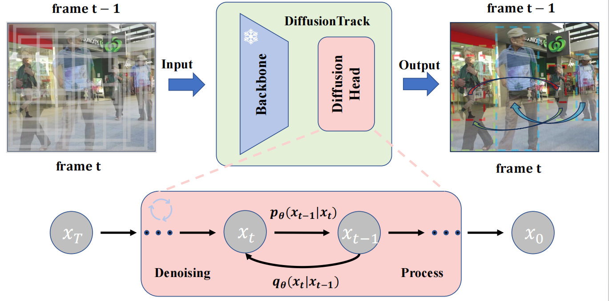
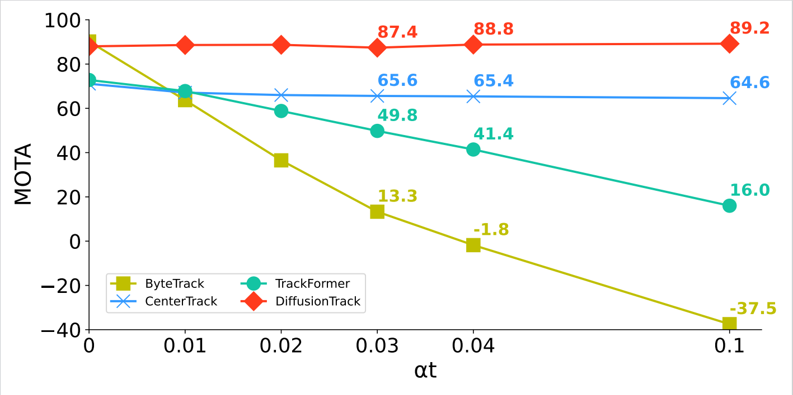

## DiffusionTrack：Diffusion Model For Multi-Object Tracking

**DiffusionTrack is the first work of diffusion model for multi-object tracking.**



[**DiffusionTrack：Diffusion Model For Multi-Object Tracking**](https://arxiv.org/abs/2308.09905)

Run Luo, Zikai Song, Lintao Ma, Jinlin Wei

*[arXiv 2308.09905](https://arxiv.org/abs/2308.09905)*

## Tracking performance

### Results on MOT17 challenge test set with 15.89 FPS

| Method             | MOTA     | IDF1     | HOTA     | AssA     | DetA     |
| ------------------ | -------- | -------- | -------- | -------- | -------- |
| TrackFormer        | 74.1     | 68.0     | 57.3     | 54.1     | 60.9     |
| MeMOT              | 72.5     | 69.0     | 56.9     | 55.2     | /        |
| MOTR               | 71.9     | 68.4     | 57.2     | 55.8     | /        |
| CenterTrack        | 67.8     | 64.7     | 52.2     | 51.0     | 53.8     |
| PermaTrack         | 73.8     | 68.9     | 55.5     | 53.1     | 58.5     |
| TransCenter        | 73.2     | 62.2     | 54.5     | 49.7     | 60.1     |
| GTR                | 75.3     | 71.5     | 59.1     | 57.0     | 61.6     |
| TubeTK             | 63.0     | 58.6     | /        | /        | /        |
| **DiffusionTrack** | **77.9** | **73.8** | **60.8** | **58.8** | **63.2** |

### Results on MOT20 challenge test set with 13.37 FPS

| Method             | MOTA     | IDF1     | HOTA     | AssA     | DetA     |
| ------------------ | -------- | -------- | -------- | -------- | -------- |
| TrackFormer        | 68.6     | 65.7     | 54.7     | 53.0     | 56.7     |
| MeMOT              | 63.7     | 66.1     | 54.1     | **55.0** | /        |
| TransCenter        | 67.7     | 58.7     | /        | /        | /        |
| **DiffusionTrack** | **72.8** | **66.3** | **55.3** | 51.3     | **59.9** |

### Results on Dancetrack challenge test set with 21.05 FPS

| Method             | MOTA     | IDF1     | HOTA     | AssA     | DetA     |
| ------------------ | -------- | -------- | -------- | -------- | -------- |
| TransTrack         | 88.4     | 45.2     | 45.5     | 27.5     | 75.9     |
| CenterTrack        | 86.8     | 35.7     | 41.8     | 22.6     | 78.1     |
| **DiffusionTrack** | **89.3** | **47.5** | **52.4** | **33.5** | **82.2** |

### Visualization results


### Robustness to detection perturbation



## Installation

Step1. Install requirements for DiffusionTrack.

```
git clone https://github.com/RainBowLuoCS/DiffusionTrack.git
cd DiffusionTrack
pip3 install -r requirements.txt
python3 setup.py develop
```

Step2. Install [pycocotools](https://github.com/cocodataset/cocoapi).

```
pip3 install cython; pip3 install 'git+https://github.com/cocodataset/cocoapi.git#subdirectory=PythonAPI'
```

Step3. Others

```
pip3 install cython_bbox
```

Step4. Install detectron2

```
git clone https://github.com/facebookresearch/detectron2.git
python -m pip install -e detectron2
```

## Data preparation

Download [MOT17](https://motchallenge.net/), [MOT20](https://motchallenge.net/), [CrowdHuman](https://www.crowdhuman.org/), [Cityperson](https://github.com/Zhongdao/Towards-Realtime-MOT/blob/master/DATASET_ZOO.md), [ETHZ](https://github.com/Zhongdao/Towards-Realtime-MOT/blob/master/DATASET_ZOO.md) ,[Dancetrack](https://github.com/DanceTrack/DanceTrack) put them under <DiffusionTrack_HOME>/datasets in the following structure:

```
datasets
   |——————mot
   |        └——————train
   |        └——————test
   └——————crowdhuman
   |         └——————Crowdhuman_train
   |         └——————Crowdhuman_val
   |         └——————annotation_train.odgt
   |         └——————annotation_val.odgt
   └——————MOT20
   |        └——————train
   |        └——————test
   └——————dancetrack
   |        └——————train
   |        └——————test
   └——————Cityscapes
   |        └——————images
   |        └——————labels_with_ids
   └——————ETHZ
            └——————eth01
            └——————...
            └——————eth07
```

Then, you need to turn the datasets to COCO format and mix different training data:

```
cd <DiffusionTrack_HOME>
python3 tools/convert_mot17_to_coco.py
python3 tools/convert_dancetrack_to_coco.py
python3 tools/convert_mot20_to_coco.py
python3 tools/convert_crowdhuman_to_coco.py
python3 tools/convert_cityperson_to_coco.py
python3 tools/convert_ethz_to_coco.py
```

Before mixing different datasets, you need to follow the operations in [mix_xxx.py](https://github.com/ifzhang/ByteTrack/blob/c116dfc746f9ebe07d419caa8acba9b3acfa79a6/tools/mix_data_ablation.py#L6) to create a data folder and link. Finally, you can mix the training data:

```
cd <DiffusionTrack_HOME>
python3 tools/mix_data_ablation.py
python3 tools/mix_data_test_mot17.py
python3 tools/mix_data_test_mot20.py
```

## Model zoo

You can download our model weight from [our model zoo](https://drive.google.com/drive/folders/1xfBo04Ncm504xFUMtC4_0g0Bf61yPsXh?usp=sharing). We provide a 32-bit precision model, you can load it and then use half-precision fine-tuning to get a 16-bit precision model weight, so that you will get the above inference speed.

## Training

The  pretrained YOLOX model can be downloaded from their [model zoo](https://github.com/ifzhang/ByteTrack). After downloading the pretrained models, you can put them under <DiffusionTrack_HOME>/pretrained.

- **Train ablation model (MOT17 half train and CrowdHuman)**

```
cd <DiffusionTrack_HOME>
python3 tools/train.py -f exps/example/mot/yolox_x_diffusion_det_mot17_ablation.py -d 8 -b 16 -o -c pretrained/bytetrack_ablation.pth.tar
python3 tools/train.py -f exps/example/mot/yolox_x_diffusion_track_mot17_ablation.py -d 8 -b 16 -o -c pretrained/diffusiontrack_ablation_det.pth.tar
```

- **Train MOT17 test model (MOT17 train, CrowdHuman, Cityperson and ETHZ)**

```
cd <DiffusionTrack_HOME>
python3 tools/train.py -f exps/example/mot/yolox_x_diffusion_det_mot17.py -d 8 -b 16 -o -c pretrained/bytetrack_x_mot17.pth.tar
python3 tools/train.py -f exps/example/mot/yolox_x_diffusion_track_mot17.py -d 8 -b 16 -o -c pretrained/diffusiontrack_mot17_det.pth.tar
```

- **Train MOT20 test model (MOT20 train, CrowdHuman)**

```
cd <DiffusionTrack_HOME>
python3 tools/train.py -f exps/example/mot/yolox_x_diffusion_det_mot20.py -d 8 -b 16 -o -c pretrained/bytetrack_x_mot20.pth.tar
python3 tools/train.py -f exps/example/mot/yolox_x_diffusion_track_mot20.py -d 8 -b 16 -o -c pretrained/diffusiontrack_mot20_det.pth.tar
```

**Train Dancetrack test model (Dancetrack)**

```
cd <DiffusionTrack_HOME>
python3 tools/train.py -f exps/example/mot/yolox_x_diffusion_det_dancetrack.py -d 8 -b 16 -o -c pretrained/bytetrack_x_mot17.pth.tar
python3 tools/train.py -f exps/example/mot/yolox_x_diffusion_track_dancetrack.py -d 8 -b 16 -o -c pretrained/diffusiontrack_dancetrack_det.pth.tar
```

## Tracking

- **Evaluation on MOT17 half val**

```
cd <DiffusionTrack_HOME>
python3 tools/track.py -f exps/example/mot/yolox_x_diffusion_track_mot17_ablation.py -c pretrained/diffusiontrack_ablation_track.pth.tar -b 1 -d 1 --fuse
```

- **Test on MOT17**

```
cd <DiffusionTrack_HOME>
python3 tools/track.py -f exps/example/mot/yolox_x_diffusion_track_mot17.py -c pretrained/diffusiontrack_mot17_track.pth.tar -b 1 -d 1 --fuse
```

- **Test on MOT20**

```
cd <DiffusionTrack_HOME>
python3 tools/track.py -f exps/example/mot/yolox_x_diffusion_track_mot20.py -c pretrained/diffusiontrack_mot20_track.pth.tar -b 1 -d 1 --fuse
```

- **Test on Dancetrack**

```
cd <DiffusionTrack_HOME>
python3 tools/track.py -f exps/example/mot/yolox_x_diffusion_track_dancetrack.py -c pretrained/diffusiontrack_dancetrack_track.pth.tar -b 1 -d 1 --fuse
```

## News
- (2024.02) [DiffMOT](https://github.com/Kroery/DiffMOT.git) is accepted by CVPR2024, demonstrating the potential of the diffusion-based tracker and once again validating our visionary insights, congratulations!
- (2023.12) Our paper is accepted by AAAI2024!
- (2023.08) Code is released!
- (2023.06) Despite being rejected by NIPS2023, we firmly believe the diffusion model is a novel solution for multi-object tracking problems.
- (2022.11) Write the first line of the code for this great idea!

## License

This project is under the CC-BY-NC 4.0 license. See [LICENSE](https://github.com/ShoufaChen/DiffusionDet/blob/main/LICENSE) for details.

## Citation

If you use DiffusionTrack in your research or wish to refer to the baseline results published here, please use the following BibTeX entry.

```
@article{luo2023diffusiontrack,
  title={DiffusionTrack: Diffusion Model For Multi-Object Tracking},
  author={Luo, Run and Song, Zikai and Ma, Lintao and Wei, Jinlin and Yang, Wei and Yang, Min},
  journal={arXiv preprint arXiv:2308.09905},
  year={2023}
}
```

## Acknowledgement

A large part of the code is borrowed from [ByteTrack](https://github.com/ifzhang/ByteTrack) and [DiffusionDet](https://github.com/ShoufaChen/DiffusionDet) thanks for their wonderful works.

